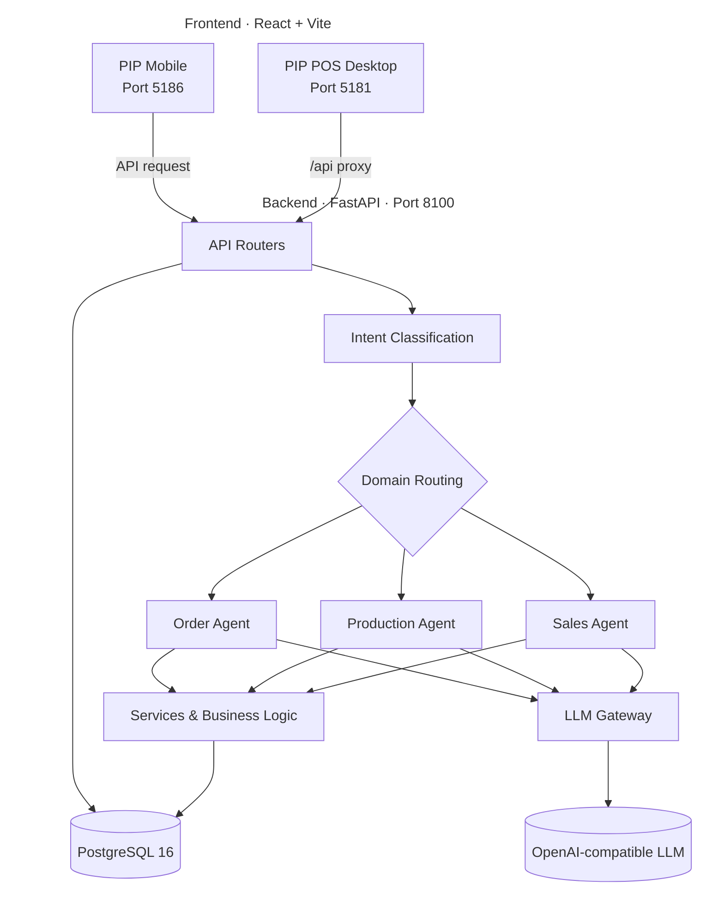

# PIP AI POS

점주의 판단을 돕는 AI 기반 매장 운영 어시스턴트 PoC

> AI-powered POS assistant for franchise store owners — sales insights, production planning, inventory decisions, and order recommendations.

매출 현황, 생산 계획, 발주 수량, 재고 위험처럼 여러 화면과 자료에 흩어진 정보를 하나의 흐름으로 연결하고, 점주가 필요한 조치를 빠르게 판단할 수 있도록 설계한 지능형 POS 시스템입니다.

`React` · `TypeScript` · `FastAPI` · `PostgreSQL` · `LLM Orchestration`
Version `v0.21.0`

**목차** — [개요](#프로젝트-개요) · [문제 정의](#문제-정의) · [주요 기능](#주요-기능) · [시스템 아키텍처](#시스템-아키텍처) · [프로젝트 구조](#프로젝트-구조) · [로컬 실행](#로컬-실행) · [사용 포트](#사용-포트) · [환경변수](#환경변수) · [PoC 범위와 한계](#poc-범위와-한계) · [Contributors](#contributors) · [License](#license-and-attribution)

---

## 프로젝트 개요

PIP AI POS는 BR코리아 던킨 가맹점주의 매장 운영 의사결정을 지원하기 위해 제작한 Proof of Concept입니다.

기존 POS가 거래 처리와 현황 조회에 집중되어 있다면, PIP AI POS는 매출·생산·발주·재고 데이터를 연결해 다음 행동까지 제안하는 것을 목표로 합니다.

점주는 복잡한 통계 자료나 엑셀 데이터를 직접 대조하는 대신 다음과 같은 질문에 빠르게 답을 얻을 수 있습니다.

* 지금 매장에서 가장 먼저 확인해야 할 문제는 무엇인가?
* 어떤 제품을 추가 생산해야 하는가?
* 재고 부족으로 발생할 수 있는 기회손실은 어느 정도인가?
* 오늘 발주해야 할 품목과 수량은 무엇인가?
* 행사나 시간대별 판매 변화에 어떻게 대응해야 하는가?

AI는 최종 결정을 대신하지 않습니다. 데이터를 해석하고 실행 가능한 선택지를 제안하며, 최종 판단과 실행은 점주가 수행하는 구조로 설계했습니다.

---

## 문제 정의

매장 운영 데이터가 존재하더라도 실제 의사결정에 활용하기 위해서는 여러 화면과 자료를 직접 비교해야 합니다.

| 운영 문제       | 기존 방식의 한계                   | PIP AI POS의 접근                       |
| ----------- | --------------------------- | ------------------------------------ |
| 재고 부족과 기회손실 | 판매가 중단된 뒤에야 부족 상황을 인지       | 소진 속도와 재고 상태를 바탕으로 생산 필요 시점을 제안      |
| 과발주·과소발주    | 담당자의 경험과 감각에 의존             | 과거 판매량, 행사, 편차 데이터를 함께 보여주고 추천 수량 제공 |
| 현황 파악 지연    | 매출, 생산, 재고, 알림을 여러 화면에서 확인  | 핵심 지표와 우선순위가 높은 이슈를 하나의 대시보드에 통합     |
| 데이터 해석 부담   | 숫자는 제공되지만 다음 행동은 사용자가 직접 판단 | AI 어시스턴트가 원인과 권장 조치를 자연어로 설명         |

---

## 담당 역할

### Product / UX Designer · AI Builder

프로젝트의 제품 방향 설정부터 UX/UI 설계, AI 인터랙션 구조, 프론트엔드 구현까지 전반을 담당했습니다.

* 점주 업무 흐름과 운영 페인포인트 정의
* 대시보드 정보 구조 및 핵심 지표 우선순위 설계
* 생산·발주·알림·AI 대화 흐름 설계
* PIP AI 어시스턴트 패널 및 제안 카드 UX 설계
* 데스크톱 POS와 모바일 화면의 디자인 시스템 구축
* React·TypeScript 기반 프론트엔드 구현
* AI 응답을 실제 운영 액션으로 연결하는 인터랙션 설계
* PoC 범위 조정 및 전체 제품 완성도 개선

백엔드 API와 데이터 파이프라인은 협업 개발자들과 함께 구성했습니다.

---

## 제품 설계 원칙

### 1. 숫자보다 판단을 먼저 보여준다

점주에게 모든 데이터를 동일한 중요도로 노출하지 않습니다.

매출 변화, 재고 위험, 생산 필요, 발주 마감처럼 즉시 판단이 필요한 정보를 우선 배치하고, 상세 데이터는 필요할 때 단계적으로 확인할 수 있도록 구성했습니다.

### 2. AI 답변을 실행 가능한 형태로 제공한다

AI가 긴 설명만 반환하면 실제 운영 흐름이 개선되지 않습니다.

PIP AI는 자연어 설명과 함께 다음과 같은 액션을 제안합니다.

* 추가 생산 확인
* 발주 수량 검토
* 재고 부족 품목 확인
* 관련 매출 데이터 열기
* 할 일 등록
* 알림 상태 변경

추천 결과는 자동 실행되지 않으며, 사용자가 내용을 확인한 뒤 직접 적용합니다.

### 3. 매장 환경에 맞는 정보 밀도를 유지한다

POS는 바쁜 오프라인 환경에서 사용되기 때문에 작은 클릭 영역이나 복잡한 탐색 구조가 작업 오류로 이어질 수 있습니다.

* 충분한 터치·클릭 영역
* 명확한 상태 구분
* 반복 작업을 고려한 짧은 이동 경로
* 핵심 정보와 보조 정보의 시각적 위계
* 데스크톱과 모바일 간 일관된 컴포넌트 규칙

을 기준으로 화면을 설계했습니다.

### 4. AI의 불확실성을 숨기지 않는다

기회손실, 생산량, 발주량과 같은 값은 데이터와 시뮬레이션을 기반으로 한 추정치입니다.

확정된 사실과 AI 추천을 시각적으로 구분하고, 추천 근거를 함께 제공해 점주가 결과를 검토할 수 있도록 설계했습니다.

---

## 주요 기능

### 매장 현황 대시보드

* 금일 매출과 시간대별 판매 흐름
* 주요 운영 지표 요약
* 재고 부족 및 기회손실 추정
* 우선 확인이 필요한 이슈
* 생산·발주 관련 추천 액션

### PIP AI 어시스턴트

* 자연어 기반 매장 데이터 질의
* 사용자 의도 분류
* 매출·생산·발주 도메인별 요청 라우팅
* 답변과 관련 액션 카드 제공
* 현재 화면과 연결된 맥락형 질문 지원

### 생산 관리

* 품목별 소진 속도 확인
* 추가 생산 필요 품목 제안
* 생산 계획과 실제 판매 흐름 비교
* 생산 관련 알림 및 할 일 관리

### 발주 관리

* 발주 필요 품목과 추천 수량 제공
* 과거 판매 데이터 및 행사 영향 반영
* 발주 마감 알림
* 과발주·과소발주 위험 확인

### 이벤트 및 프로모션

* 캠페인·이벤트 일정 확인
* 행사 기간 판매 변화 확인
* 이벤트와 연관된 권장 액션 제공

### 알림 및 할 일

* 중요도 기반 알림 정렬
* 운영 이슈를 할 일로 전환
* 처리 상태 관리
* 데스크톱과 모바일 간 동일한 작업 흐름 제공

### 서버 측 보안

* 응답 데이터 마스킹
* 감사 로그 기록
* 환경변수를 통한 자격증명 관리
* 실제 비밀 값이 포함되지 않은 예제 환경설정 제공

---

## AI가 필요한 이유

이 프로젝트에서 AI는 단순한 챗봇 기능을 추가하기 위해 사용되지 않았습니다.

매출, 재고, 생산, 발주 데이터는 서로 연결되어 있으며, 점주가 질문한 상황에 따라 확인해야 할 데이터와 설명 방식이 달라집니다.

예를 들어 “오늘 어떤 제품을 더 만들어야 해?”라는 질문은 다음 과정을 필요로 합니다.

1. 사용자의 의도를 생산 관련 질문으로 분류
2. 현재 재고와 시간대별 판매량 조회
3. 예상 판매량과 남은 영업시간 비교
4. 생산 필요 품목과 수량 계산
5. 추천 근거와 함께 점주에게 설명
6. 생산 계획 확인 또는 할 일 등록 액션 제공

규칙 기반 UI만으로도 일부 기능은 구현할 수 있지만, 다양한 질문을 동일한 입력 방식으로 처리하고 데이터의 의미를 설명하는 부분에서 AI가 워크플로우를 단축합니다.

다만 수량 계산, 데이터 조회, 권한 검증과 같이 정확성이 필요한 영역은 LLM에만 의존하지 않고 서버 로직과 데이터베이스를 통해 처리합니다.

---

## 시스템 아키텍처



### 기술 구성

| 영역               | 기술                                                         |
| ---------------- | ---------------------------------------------------------- |
| Desktop / Mobile | React 18, TypeScript, Vite                                 |
| UI               | Tailwind CSS, Radix UI, MUI                                |
| Backend          | FastAPI, Pydantic, SQLAlchemy Async                        |
| Database         | PostgreSQL 16                                              |
| Migration        | Alembic                                                    |
| Scheduler        | APScheduler                                                |
| Python Package   | Poetry, Python 3.11                                        |
| LLM              | OpenAI-compatible API, self-hosted vLLM 또는 llama.cpp 연동 가능 |

---

## 프로젝트 구조

```text
spc-ai-pos/
├── backend/
│   ├── app/
│   │   ├── agents/             # 매출·생산·발주 도메인 에이전트
│   │   ├── orchestration/      # 사용자 의도 분류 및 라우팅
│   │   ├── routers/            # REST API 엔드포인트
│   │   ├── services/           # LLM 게이트웨이, 마스킹, 비즈니스 로직
│   │   ├── tools/              # 예측 및 기회손실 계산
│   │   └── schemas/            # Pydantic 요청·응답 스키마
│   ├── alembic/                # 데이터베이스 마이그레이션
│   ├── config/                 # 이벤트 및 애플리케이션 설정
│   ├── scripts/                # 시드 데이터 및 유지보수 스크립트
│   └── tools/                  # 공용 계산 유틸리티
│
├── pip-pos/                    # 점주용 데스크톱 POS
├── pip-mobile/                 # 점주용 모바일 화면
├── dd_img/                     # 데모용 제품 이미지
├── docs/
│   └── screenshots/            # README 화면 이미지
├── infra/
│   └── env/                    # 컨테이너 환경변수 예시
├── scripts/                    # 로컬 개발 실행 스크립트
├── docker-compose.yml
├── .env.example
├── ATTRIBUTIONS.md
└── LICENSE
```

---

## 로컬 실행

### 사전 요구사항

* Node.js 18 이상
* npm
* Python 3.11 이상
* Poetry
* Docker 또는 로컬 PostgreSQL 16
* 선택 사항: OpenAI 호환 LLM 엔드포인트

LLM 엔드포인트를 연결하지 않아도 일부 화면과 API는 확인할 수 있지만, AI 응답 기능은 제한될 수 있습니다.

### 1. 환경변수 설정

```bash
cp .env.example .env
cp infra/env/backend.env.example infra/env/backend.env
```

생성된 파일에 로컬 환경에 맞는 값을 입력합니다.

실제 비밀번호와 API 키가 포함된 `.env` 파일은 Git에 커밋하지 않습니다.

### 2. PostgreSQL 및 백엔드 실행

```bash
docker compose up -d --build
```

정상 실행 여부 확인:

```bash
curl http://localhost:8100/health
```

컨테이너 로그 확인:

```bash
docker compose logs -f backend
```

### 3. 백엔드 로컬 실행

Docker 대신 백엔드를 로컬에서 실행하려면:

```bash
cd backend

cp .env.example .env
poetry install
poetry run alembic upgrade head
poetry run uvicorn app.main:app \
  --host 0.0.0.0 \
  --port 8100 \
  --reload
```

### 4. PIP POS 실행

새 터미널에서:

```bash
cd pip-pos
npm ci
npm run dev -- --host 0.0.0.0 --port 5181
```

### 5. PIP Mobile 실행

새 터미널에서:

```bash
cd pip-mobile
npm ci
npm run dev -- --host 0.0.0.0 --port 5186
```

프로젝트 실행 스크립트를 사용하는 경우:

```bash
./scripts/start-dev.sh all
```

---

## 사용 포트

| 서비스                  |     포트 | 설명                      |
| -------------------- | -----: | ----------------------- |
| FastAPI Backend      | `8100` | REST API 및 PIP AI 요청 처리 |
| PIP POS              | `5181` | 점주용 데스크톱 POS            |
| PIP Mobile           | `5186` | 점주용 모바일 화면              |
| PostgreSQL           | `5433` | 호스트 연결 포트               |
| PostgreSQL Container | `5432` | 컨테이너 내부 포트              |

---

## 환경변수

| 파일                      | 용도                            |
| ----------------------- | ----------------------------- |
| `.env`                  | Docker Compose용 PostgreSQL 설정 |
| `backend/.env`          | 백엔드 로컬 실행 설정                  |
| `infra/env/backend.env` | 백엔드 컨테이너 실행 설정                |
| `pip-pos/.env`          | 데스크톱 프론트엔드 API 설정             |
| `pip-mobile/.env`       | 모바일 프론트엔드 API 설정              |

주요 백엔드 환경변수:

```text
DATABASE_URL
OPENAI_BASE_URL
OPENAI_API_KEY
OPENAI_MODEL
CORS_ORIGINS
```

각 디렉터리의 `*.env.example` 파일을 복사한 뒤 실제 값을 입력하세요.

---

## 빌드

### PIP POS

```bash
cd pip-pos
npm ci
npm run build
```

### PIP Mobile

```bash
cd pip-mobile
npm ci
npm run build
```

---

## PoC 범위와 한계

이 저장소는 실제 상용 운영 시스템이 아니라 제품 가능성과 사용자 경험을 검증하기 위한 PoC입니다.

* 포함된 데이터와 지표는 데모 목적의 예시이며 실제 운영 수치가 아닙니다.
* 기회손실, 예상 판매량, 추천 생산량은 시뮬레이션 로직을 기반으로 한 근사치입니다.
* 추천 결과는 실제 매장 운영 전에 담당자의 검토가 필요합니다.
* LLM 응답 품질은 연결한 모델, 데이터 범위, 프롬프트 설정에 따라 달라질 수 있습니다.
* 실제 운영 환경에서는 인증, 권한, 모니터링, 장애 대응, 개인정보 보호에 대한 추가 설계가 필요합니다.
* 본 PoC는 BR코리아 또는 던킨의 공식 운영 제품이 아닙니다.

---

## Contributors

| 역할                                 | 기여자                                     | 주요 기여                                        |
| ---------------------------------- | --------------------------------------- | -------------------------------------------- |
| Product / UX Designer · AI Builder | [Power-xc](https://github.com/Power-xc)               | 제품 방향, UX/UI, AI 어시스턴트 구조, 프론트엔드 구현, 프로젝트 리드 |
| 기획 · 프론트엔드                          | [ryuyeoungkeoung](https://github.com/ryuyeoungkeoung) | 제품 기획 및 프론트엔드 구현                             |
| 백엔드 엔지니어                            | [taxuyou](https://github.com/taxuyou)                 | 백엔드 API 및 서비스 구현                             |
| 데이터 엔지니어                            | [Won-github](https://github.com/Won-github)           | 데이터 파이프라인 및 데이터 연동                           |

---

## License and Attribution

소스 코드는 [MIT License](LICENSE)에 따라 배포됩니다.

던킨, Dunkin’, BR코리아, SPC를 포함한 브랜드명과 로고는 각 권리자에게 귀속됩니다. `dd_img/` 디렉터리에 포함된 제품 이미지와 브랜드 자산은 MIT 라이선스 적용 대상이 아닙니다.

자세한 출처와 사용 범위는 [ATTRIBUTIONS.md](ATTRIBUTIONS.md)를 확인하세요.

---

## Contact

프로젝트 관련 문의와 개선 제안은 GitHub Issue를 통해 남겨주세요.
