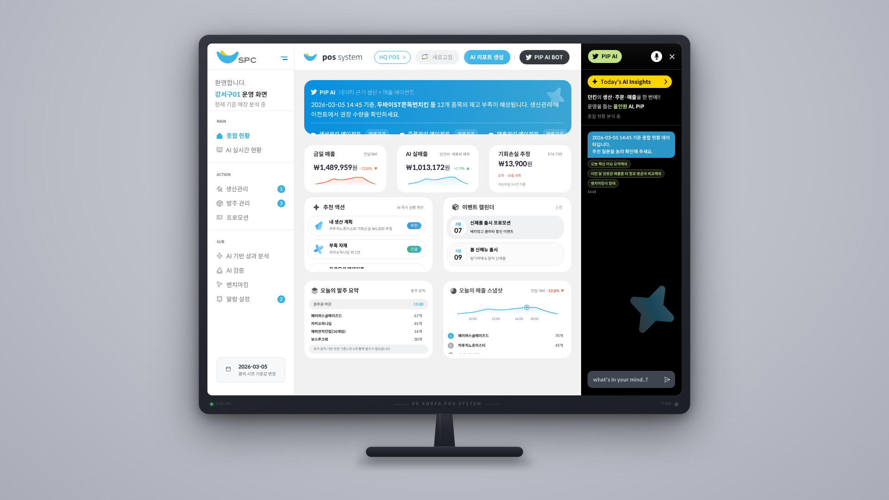
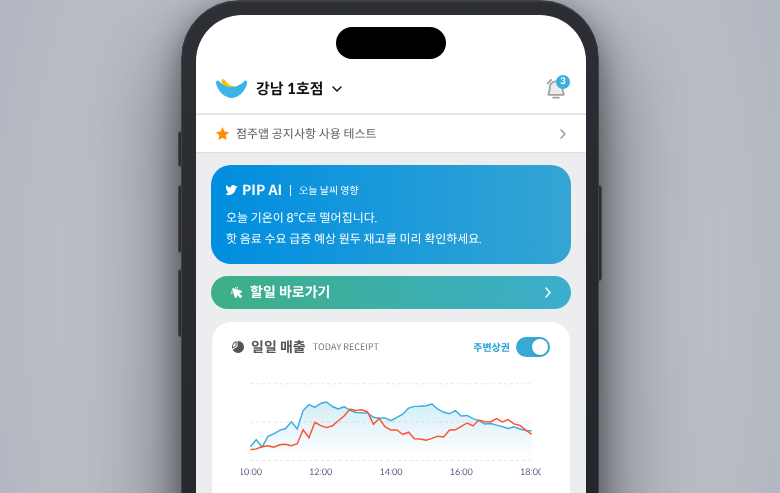
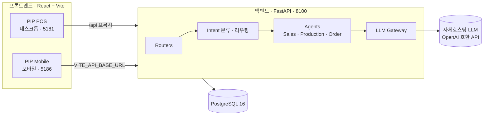

# FoxPOS — 점주용 POS AI 어시스턴트 (PoC)

FoxPOS는 **BR코리아(던킨) 가맹점주**를 위한 AI 어시스턴트 POS 시스템의 개념 증명(Proof of Concept)입니다.
매장 데이터(매출·생산·발주·재고)를 바탕으로 **PIP AI**가 실시간 인사이트, 발주 추천, 기회손실 추정, 대화형 질의응답을 제공합니다.

> **English TL;DR** — FoxPOS is a proof-of-concept AI assistant POS for Dunkin (BR Korea) franchise owners.
> A FastAPI backend orchestrates domain agents (sales / production / ordering) over a self-hosted,
> OpenAI-compatible LLM and PostgreSQL, serving two React + Vite frontends: **PIP POS** (desktop) and
> **PIP Mobile**. This repository is a PoC — the data and models are for demonstration only.

<p align="center">
  <br/>
  <em>PIP POS 데스크톱 — 종합 현황 대시보드와 PIP AI 패널</em>
</p>

<p align="center">
  <br/>
  <em>PIP Mobile — 점주 모바일 화면</em>
</p>

---

## 주요 기능

- **PIP AI 대화형 어시스턴트** — 자연어 질문을 의도(intent) 분류 후 도메인 에이전트로 라우팅해 답변
- **실시간 인사이트** — 금일 매출, AI 실매출, 기회손실 추정 등 핵심 지표를 카드로 요약
- **생산·발주 관리** — 생산 계획 추천, 발주 필요 품목/수량 제안, 발주 마감 알림
- **프로모션·이벤트** — 캠페인/이벤트 캘린더 및 관련 액션 추천
- **알림 & 할일** — 우선순위 기반 알림과 할일(To-Do) 관리
- **데이터 마스킹 / 감사 로그** — 응답 마스킹과 감사 로깅을 포함한 서버 측 보안 계층

## 아키텍처



- **Backend** — FastAPI · SQLAlchemy(async) · Alembic · Pydantic · APScheduler · Poetry (Python 3.11)
- **Frontend** — React 18 · Vite · TypeScript · Tailwind CSS · Radix UI · MUI
- **DB** — PostgreSQL 16
- **LLM** — OpenAI 호환 엔드포인트(자체호스팅 vLLM / llama.cpp 등)를 `OPENAI_BASE_URL`로 연결

## 프로젝트 구조

```text
spc-ai-pos/
├── backend/            # FastAPI 백엔드 (포트 8100)
│   ├── app/            # 메인 애플리케이션 (app.main:app)
│   │   ├── agents/     #   도메인 에이전트 (sales / production / order)
│   │   ├── orchestration/  # 의도 분류 · 라우팅
│   │   ├── routers/    #   REST 엔드포인트
│   │   ├── services/   #   LLM 게이트웨이 · 마스킹 등
│   │   ├── tools/      #   예측 · 기회손실 계산 등
│   │   └── schemas/    #   Pydantic 스키마
│   ├── alembic/        # DB 마이그레이션
│   ├── config/         # 이벤트 설정(events.json)
│   ├── scripts/        # 시드/유지보수 스크립트
│   └── tools/          # 공용 계산 유틸
├── pip-pos/            # 점주 PIP POS 프론트 — 데스크톱 5181 (모바일 프리뷰 5174)
├── pip-mobile/         # 점주 PIP Mobile 프론트 — 5186
├── dd_img/             # 제품 이미지 (도넛류 · 음료 · 패키지)
├── infra/env/          # 컨테이너 환경변수 예시
├── scripts/            # 개발 실행 스크립트
├── docker-compose.yml  # PostgreSQL + 백엔드
└── .env.example        # 로컬 Postgres 비밀번호 (compose용)
```

## 로컬 실행

### 사전 요구사항
- Node.js 18+ / npm
- Python 3.11+ / [Poetry](https://python-poetry.org/)
- Docker (PostgreSQL 실행용) 또는 로컬 PostgreSQL 16
- (선택) OpenAI 호환 LLM 엔드포인트 — 없으면 LLM 응답 기능이 제한됩니다.

### 1) 백엔드 + 데이터베이스 (Docker Compose)

```bash
# 로컬 Postgres 비밀번호 설정
cp .env.example .env                       # POSTGRES_PASSWORD 값 지정
cp infra/env/backend.env.example infra/env/backend.env   # LLM 등 백엔드 설정

# PostgreSQL + 백엔드 기동 (마이그레이션 자동 적용)
docker compose up -d --build

# 헬스체크
curl http://localhost:8100/health
```

백엔드만 로컬(비-Docker)로 실행하려면:

```bash
cd backend
cp .env.example .env        # DATABASE_URL 등 설정
poetry install
poetry run alembic upgrade head
poetry run uvicorn app.main:app --host 0.0.0.0 --port 8100 --reload
```

### 2) 프론트엔드 (npm)

```bash
# PIP POS (데스크톱)
cd pip-pos && npm install && npm run dev -- --host 0.0.0.0 --port 5181

# PIP Mobile
cd pip-mobile && npm install && npm run dev -- --host 0.0.0.0 --port 5186
```

또는 한 번에: `./scripts/start-dev.sh all`

### 포트

| 서비스 | 포트 | 설명 |
|--------|------|------|
| Backend (FastAPI) | `8100` | REST API + PIP AI 채팅 |
| PIP POS (데스크톱) | `5181` | 점주 데스크톱 POS (`/api` → 8100 프록시) |
| PIP Mobile | `5186` | 점주 모바일 |
| PostgreSQL | `5433` | Docker Compose (컨테이너 내부 5432) |

## 환경 변수

| 파일 | 용도 |
|------|------|
| `.env` | docker-compose용 `POSTGRES_PASSWORD` |
| `backend/.env` | 백엔드 로컬 실행 설정 (`DATABASE_URL`, `OPENAI_*`, `CORS_ORIGINS` …) |
| `infra/env/backend.env` | docker-compose 백엔드 컨테이너 설정 |
| `pip-pos/.env` · `pip-mobile/.env` | 프론트 API 베이스 URL 등 |

각 디렉터리의 `*.env.example`을 복사해 실제 값을 채우세요. **실제 `.env`는 커밋하지 않습니다.**

## PoC 안내

이 저장소는 **개념 증명(PoC)**입니다.

- 포함된 데이터/지표는 데모 목적의 예시이며 실제 운영 수치가 아닙니다.
- LLM 응답 품질은 연결한 모델과 프롬프트 구성에 따라 달라집니다.
- 일부 예측/추정 값(기회손실 등)은 시뮬레이션 로직 기반의 근사치입니다.

## 브랜드 · 라이선스

- 소스 코드는 [MIT License](LICENSE)로 배포됩니다.
- **던킨/Dunkin, BR코리아, SPC 등 브랜드명·로고와 `dd_img/`의 제품 이미지는 각 권리자의 자산**이며 MIT 라이선스 대상이 아닙니다. 자세한 출처는 [ATTRIBUTIONS.md](ATTRIBUTIONS.md)를 참고하세요.
